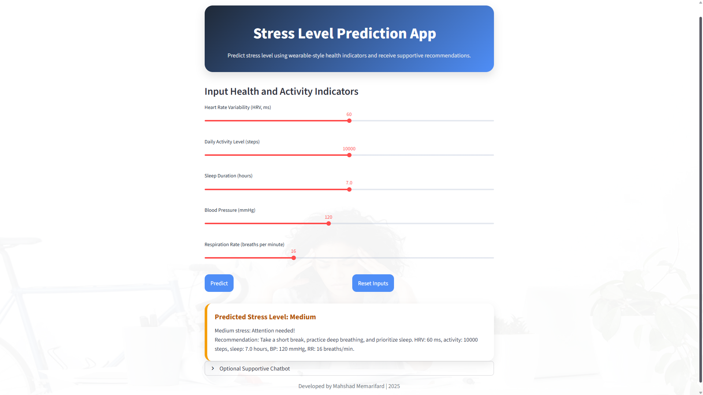

# Stress Level Prediction App with Machine Learning and Streamlit

## Project Overview

This project is a proof-of-concept AI application for predicting stress levels using wearable-style health and activity data. The system uses input features such as heart rate variability, activity level, sleep duration, blood pressure, and respiration rate to classify stress levels and provide short supportive recommendations.

The project combines machine learning, an interactive Streamlit interface, an optional Gemini-powered chatbot, and Docker-based deployment preparation.

## App Screenshot



## Features

* Predicts stress level as Low, Medium, or High
* Uses wearable-style input data such as HRV, activity, sleep, blood pressure, and respiration rate
* Provides personalized stress-management recommendations
* Includes an interactive Streamlit web interface
* Includes an optional Gemini-based chatbot for supportive responses
* Includes Docker support for containerized deployment

## Input Features

The model uses the following input variables:

* Heart Rate Variability (HRV)
* Activity Level
* Sleep Duration
* Blood Pressure
* Respiration Rate

## Technologies Used

- Python
- Streamlit
- PyTorch
- NumPy
- Scikit-learn
- Joblib
- Google Gemini API
- Docker

## Project Structure

```text
Stress-Predictor-Project/
│
├── docs/
│   ├── design.md
│   ├── requirements.py
│   └── requirements.txt
│
├── src/
│   ├── app.py
│   ├── train_model.py
│   ├── test_model.py
│   ├── background.jpg
│   ├── data/
│   ├── models/
│   │   ├── scaler.joblib
│   │   └── stress_model.pth
│   └── utils/
│
├── Dockerfile
├── README.md
├── requirements.txt
├── .gitignore
└── .env.example
```

## How to Run Locally

Clone the repository:

```bash
git clone https://github.com/Mahshad93/Stress-Predictor-Project.git
cd Stress-Predictor-Project
```

Create and activate a virtual environment:

For PowerShell:

```powershell
python -m venv .venv
.\.venv\Scripts\Activate.ps1
```

For Command Prompt:

```cmd
python -m venv .venv
.venv\Scripts\activate
```

Install the required dependencies:

```bash
pip install -r requirements.txt
```

Optional: configure the Gemini API key for the chatbot.

Create a `.env` file locally or set the environment variable manually:

```text
GEMINI_API_KEY=your_api_key_here
```

Do not commit your `.env` file to GitHub.

Run the Streamlit app:

```bash
streamlit run src/app.py
```

## Docker Usage

Build the Docker image:

```bash
docker build -t stress-predictor .
```

Run the container:

```bash
docker run -p 8501:8501 stress-predictor
```

Then open the local Streamlit URL in your browser.

## Security Note

The Gemini API key is not stored in the source code. The application reads it from the `GEMINI_API_KEY` environment variable. A sample `.env.example` file is provided only as a template.

## Disclaimer

This project is an academic proof-of-concept prototype. It is not intended for medical diagnosis, treatment, or clinical decision-making. The predictions and recommendations should not replace professional medical advice.

## Future Improvements

* Improve the model using larger and more realistic wearable datasets
* Add model evaluation metrics and visual performance reports
* Add explainability for stress predictions
* Improve the Streamlit user interface
* Deploy the app online
